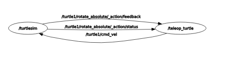

# ROS 2 and Gazebo samples

## 1. Build Docker Image

Build the Docker image:

```bash
docker build -t ros2_gazebo_cuda_img -f ros2_gazebo.Dockerfile .
```

## 2. Start Docker Container

Execute the following command to start the container with the necessary environment variables and volume mappings:

```bash
docker run --rm -it \
    --name ros2_gazebo_cuda_ctn \
    --env="DISPLAY=$DISPLAY" \
    --env="QT_X11_NO_MITSHM=1" \
    --volume="/tmp/.X11-unix:/tmp/.X11-unix:rw" \
    --net=host \
    --gpus='device=0' \
    --shm-size 8G \
    --volume="$PWD:/workspace/" \
    -w /workspace/ \
    ros2_gazebo_cuda_img:latest /bin/bash
```

## 3. Environment Setup Inside Docker

Once inside the Docker container, activate the ROS 2 environment:

```bash
source /opt/ros/jazzy/setup.bash
```

## 4. Configure X11 for GUI Applications

If you need to open a new terminal or ensure GUI applications work correctly, run the following command to allow X11 connections:

```bash
docker ps | grep "ros2_gazebo_cuda_ctn" | awk '{ print $1 }' | xargs -I {} sh -c "xhost +local:{}"
```

Test if everything is run, open 2 docker in 2 terminal 
```
docker start ros2_gazebo_cuda_ctn && docker exec -it ros2_gazebo_cuda_ctn bash
```

In the first terminal
```
ros2 run demo_nodes_py talker
```

Result should be similar
```
root@server:/workspace/ros2_ws# ros2 run demo_nodes_py talker
[INFO] [1782099678.269108413] [talker]: Publishing: "Hello World: 0"
[INFO] [1782099679.261464816] [talker]: Publishing: "Hello World: 1"
```

In second termimal
```
ros2 run demo_nodes_py listener
```
Result should be similar to
```
root@server:/workspace/ros2_ws/src/my_robot_controller/my_robot_controller# ros2 run demo_nodes_py listener
[INFO] [1782099684.269607677] [listener]: I heard: [Hello World: 6]
[INFO] [1782099685.262095269] [listener]: I heard: [Hello World: 7]
```

Open other terminal as show node graph
```
rqt_graph
```

Test with turtle sim node
```
ros2 run turtlesim turtlesim_node 
```

Control turtlesim with 
```
ros2 run turtlesim turtle_teleop_key
```

Check graph
```
rqt_graph
```
Result should look like


## 5. Create a New Package

To create a new ROS 2 package, use the following command:

```bash
ros2 pkg create my_robot_controller --build-type ament_python --dependencies rclpy
```

build 
```
cd /workspace/ros2_ws && colcon build --symlink-install && cd -
```
Run your node
```
ros2 run my_robot_controller test_node
```
Result should be
```
root@server:/workspace/ros2_ws# ros2 run my_robot_controller test_node
[INFO] [1782100128.037102553] [my_first_node]: Hello, ROS 2!
```